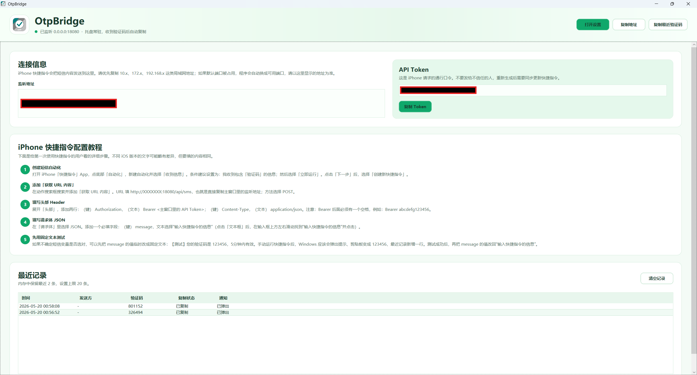

# OtpBridge

[中文](README.md) | [English](README_EN.md)

OtpBridge is a local Windows verification-code bridge: after an iPhone receives a verification-code SMS message, an iOS Shortcut sends the SMS body to Windows; OtpBridge extracts the code, copies it to the clipboard, and shows a desktop notification.

> **Important: the iPhone and Windows PC must be on the same local network.**
>
> The most common working setup is that both devices are connected to the same Wi-Fi, or are otherwise inside the same home or office LAN. If the iPhone is using cellular data, a guest network, or a different subnet, the Shortcut usually cannot reach OtpBridge.

## Purpose

OtpBridge is for users who want to receive iPhone SMS verification codes quickly on Windows. It does not depend on Microsoft's "Phone Link", Phone Link itself, or any other phone-sync software; it uses a local-network HTTP request as the bridge.

The default setup aims to be practical out of the box: the first launch generates an API Token, shows the LAN access address, and automatically copies incoming codes. Recent records are kept only in memory by default. Full SMS content is not written to disk.

<div align="center">
  
  <br>
  Application overview
</div>

<br>

<div align="center">
  
  <br>
  Verification-code notification
</div>

## Feature Overview

- Windows client: C#, .NET 8, WPF.
- Built-in lightweight HTTP service: listens on `0.0.0.0:18080` by default.
- Endpoint: `POST /api/sms`, protected by Bearer Token authentication.
- Automatically extracts 4 to 8 digit or alphanumeric verification codes.
- Can automatically copy the verification code to the clipboard.
- Can show Windows bottom-right notifications, with tray balloon tips as a fallback.
- Runs persistently in the system tray. Right-click to open settings, copy the most recent verification code, view records, toggle launch at startup, or exit.
- Launch at startup is enabled by default. After Windows sign-in, the app starts minimized to the tray.
- Single-instance mode: if the app is already running in the tray, double-clicking it again will not start a second process.
- If the default port is already in use, the app automatically switches to the next available port and shows the new listening address in the main window.
- Recent records are kept only in memory by default. Full SMS messages are not written to disk.
- Supports switching the interface between Chinese and English. Chinese is the default.
- Configuration file path: `%AppData%\OtpBridge\config.json`.

## Install and Run

### Portable Version

Download the latest `.zip` package from Releases, extract it, and run it directly.

### Publish from Source

Run this command in the project root:

```powershell
.\publish-win-x64.cmd
```

The generated files are placed in:

```text
dist\OtpBridge\OtpBridge.exe
dist\OtpBridge-Portable-win-x64.zip
```

`dist\OtpBridge\OtpBridge.exe` is a self-contained single-file exe. The portable zip can be distributed directly to users.

For development and debugging, you can also run:

```powershell
dotnet run --project .\OtpBridge\OtpBridge.csproj
```

### Clean Generated Files

To remove old `bin`, `obj`, `dist`, and temporary publish folders, run:

```powershell
.\clean-generated.cmd
```

This script deletes generated files only. It does not delete source code, and it does not delete user configuration under `%AppData%\OtpBridge`.

## First Launch of the Windows Client

The main window shows:

- Listening address, for example `http://192.168.1.20:18080/api/sms`
- API Token
- iPhone Shortcuts setup guide
- Recently received verification-code records

On the iPhone, enter the LAN address shown in the main window. Do not enter:

```text
http://0.0.0.0:18080/api/sms
```

If multiple addresses appear in the window, prefer the address in the same Wi-Fi subnet as your phone. Common formats are:

```text
http://192.168.x.x:18080/api/sms
http://10.x.x.x:18080/api/sms
http://172.16.x.x:18080/api/sms
```

The range from `172.16.x.x` to `172.31.x.x` is also a common private LAN address range.

If the main window says something like "port 18080 is in use, automatically switched to 0.0.0.0:18081", use the new address shown in the main window, for example:

```text
http://192.168.1.20:18081/api/sms
```

Do not guess the port manually. Always use the address displayed in the window.

Before configuring the Shortcut, you can open this in iPhone Safari:

```text
http://<Windows LAN IP>:18080/health
```

If you see:

```json
{"ok":true}
```

then the iPhone can access OtpBridge on Windows.

## iPhone Shortcuts Setup Steps

The following detailed steps are for first-time Shortcut users. Wording may vary slightly across iOS versions, but the required fields are the same.

### 1. Create an SMS Automation

1. Open the iPhone Shortcuts app.
2. Tap "Automation" at the bottom.
3. Create a new automation and choose "Message Received".
4. A recommended condition is: when I receive a message containing "验证码"; then choose "Run Immediately".
5. After tapping "Next", choose "Create New Shortcut".

### 2. Add "Get Contents of URL"

Search for and add this action:

```text
Get Contents of URL
```

Fill in:

```text
URL: http://XXXXXXX:18080/api/sms
Method: POST
```

Use the URL copied directly from the listening address shown in the OtpBridge main window.

### 3. Fill in Headers

Expand "Headers" and add two rows:

```text
Key: Authorization    Text: Bearer <API Token from the main window>
Key: Content-Type     Text: application/json
```

Note: there must be one space after `Bearer`.

For example:

```text
Authorization    Bearer abcdefg123456
```

### 4. Fill in the JSON Request Body

In "Request Body", choose:

```text
JSON
```

Add one required field. After tapping the text field, swipe left or right through the variable suggestions above the input box, find "Shortcut Input", and tap it:

```text
Key: message
Text: "Shortcut Input"
```

"Shortcut Input" is the SMS body received by the automation. It usually appears as a blue variable block. You may also see similar variables such as "Received Message Body" or "Shortcut Input"; choose the one that represents the full SMS content.

Optional fields can be left empty:

```text
sender
receivedAt
```

The MVP only needs the `message` field.

### 5. Test with Fixed Text First

If you are not sure whether the SMS variable is selected correctly, temporarily set the `message` value to fixed text:

```text
[Test] Your verification code is 123456, valid for 5 minutes
```

After manually running the Shortcut, Windows should:

- Show a notification in the bottom-right corner.
- Change the clipboard to `123456`.
- Add a new row under "Recent Records" in the main window.

After the test succeeds, change the `message` value back to "Shortcut Input".

## Long-term Usage Notes

Usually, you do not need to reconfigure the iPhone after every restart.

The iOS Shortcut remains valid long-term as long as:

- The iPhone and Windows PC are still on the same local network.
- The Windows LAN IP does not change.
- The listening port does not change. The default is `18080`.
- The API Token does not change.

OtpBridge saves settings in:

```text
%AppData%\OtpBridge\config.json
```

Launch at startup is enabled by default. After Windows sign-in, OtpBridge starts automatically and minimizes to the tray. As long as the LAN address, port, and Token do not change, the iPhone can continue using the original URL and Token.

You usually need to update the iPhone Shortcut if:

- The iPhone and Windows PC are no longer on the same local network.
- The Windows LAN IP changes.
- You change the listening port.
- You regenerate the API Token.
- You move the exe to another location and the old launch-at-startup path becomes invalid.

If you want the setup to remain valid for as long as possible, reserve a DHCP address for the Windows PC in your router, or configure a static LAN IP for the PC.

## Settings

| Setting | Default | Description |
| --- | --- | --- |
| Listening port | `18080` | After modification, the local HTTP service restarts automatically. If the port is occupied, the app automatically switches to a later available port. |
| API Token | Generated automatically | iPhone requests must include `Authorization: Bearer <token>`. |
| Auto copy | Enabled | Writes the verification code to the clipboard after receiving it. |
| Bottom-right notification | Enabled | Shows a Windows notification after receiving a verification code. If Toast is unavailable, tray balloon tips are used as a fallback. |
| Launch at startup | Enabled | Starts automatically for the current user after Windows sign-in and minimizes to the tray. |
| Interface language | Chinese | Can switch between Chinese and English. |
| Recent record count | `20` | Kept only in memory. Full SMS content is not written. |
| Custom regex | Empty | Can be filled in for special SMS formats. If capture groups are present, the last non-empty capture group is preferred. |

## Tray Menu

Right-click the OtpBridge icon in the system tray to:

- Open settings
- Copy the most recent verification code
- View recent records
- Check or uncheck "Launch at startup"
- Exit

Closing the main window does not exit the program; it only hides the window to the tray. To exit completely, right-click the tray icon and choose "Exit".

## API

### `POST /api/sms`

Headers:

```text
Authorization: Bearer <token>
Content-Type: application/json
```

Request:

```json
{
  "message": "[Some service] Your verification code is 123456, valid for 5 minutes",
  "sender": "optional",
  "receivedAt": "optional"
}
```

Success:

```json
{
  "ok": true,
  "code": "123456"
}
```

Failure:

```json
{
  "ok": false,
  "error": "reason"
}
```

Health check:

```text
GET /health
```

The root path also returns the app name and version:

```text
GET /
```

## Verification-code Extraction Rules

The extractor first tries to match codes near keywords:

```text
验证码、校验码、动态码、code、otp
```

If no keyword match is found, it falls back to searching for 4 to 8 character alphanumeric strings that contain at least one digit. The program tries to avoid obvious non-codes such as phone numbers, years, amounts, order numbers, account suffixes, and similar numeric values.

For special SMS formats, you can enter a custom regex in settings, for example:

```regex
安全码[:：]\s*([A-Z0-9]{6})
```

## FAQ

### iPhone Cannot Access OtpBridge

Check the network condition first. **The iPhone and Windows PC must be on the same local network**; this is required for access to work.

- Whether the iPhone and Windows are on the same Wi-Fi network or the same LAN.
- Whether iPhone Safari can open `http://<Windows LAN IP>:18080/health`.
- Whether Windows Firewall allows OtpBridge to access "Private networks".
- Whether the iOS Shortcut uses the correct URL instead of `0.0.0.0`.
- If the app automatically changed the port, whether the URL in the iOS Shortcut was also updated to the new address shown in the main window.

### The App Says the Port Is Occupied

This usually has one of two causes:

- OtpBridge is already running in the tray, and you double-clicked it again. The newer version blocks the second instance and tells you to check the tray.
- Another program on the computer is using `18080`. The newer version automatically switches to a later available port, such as `18081`, and saves it to the configuration file. The iOS Shortcut must use the new address shown in the main window.

### The API Returns `unauthorized`

The token does not match. Copy the current Token from the main window again and confirm that the Header is:

```text
Authorization: Bearer <token>
```

There must be one space after `Bearer`.

### The API Returns `code not found`

Windows received the SMS body, but no verification code was extracted. Confirm that the `message` field contains the full SMS text, or enter a custom regex in settings.

### No Bottom-right Notification Appears

Confirm that "Bottom-right notification" is enabled in settings. The program first shows a tray balloon tip and then attempts to show a Windows Toast. Also check whether Windows system notifications are disabled or Focus Assist is enabled.

### Build Errors or Old Files Remain

Exit OtpBridge from the tray first, then run:

```powershell
.\clean-generated.cmd
.\publish-win-x64.cmd
```

After publishing, use the files under `dist`:

```text
dist\OtpBridge\OtpBridge.exe
dist\OtpBridge-Portable-win-x64.zip
```
